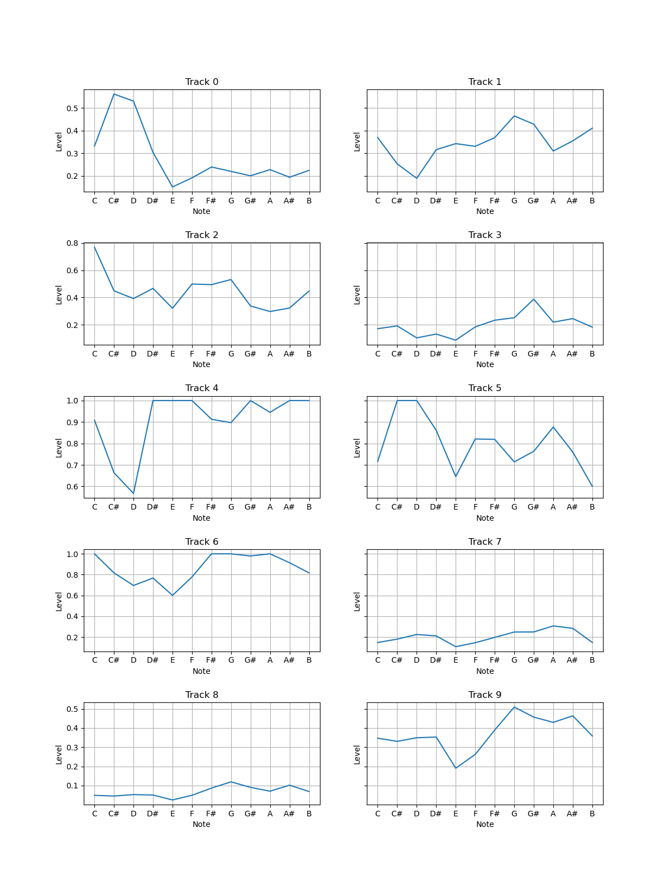
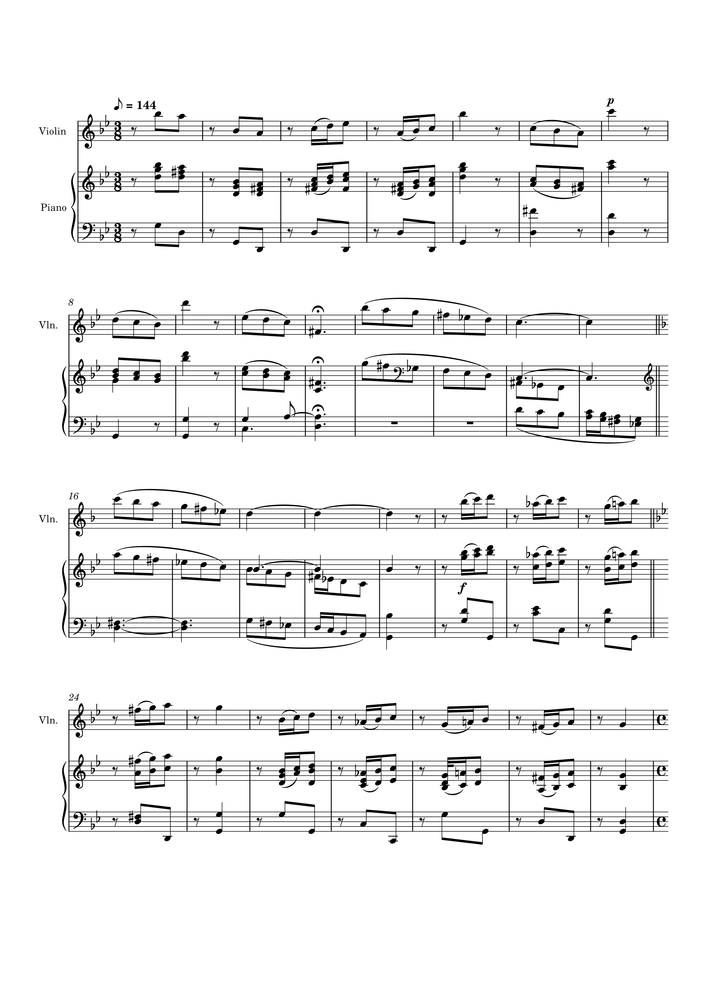
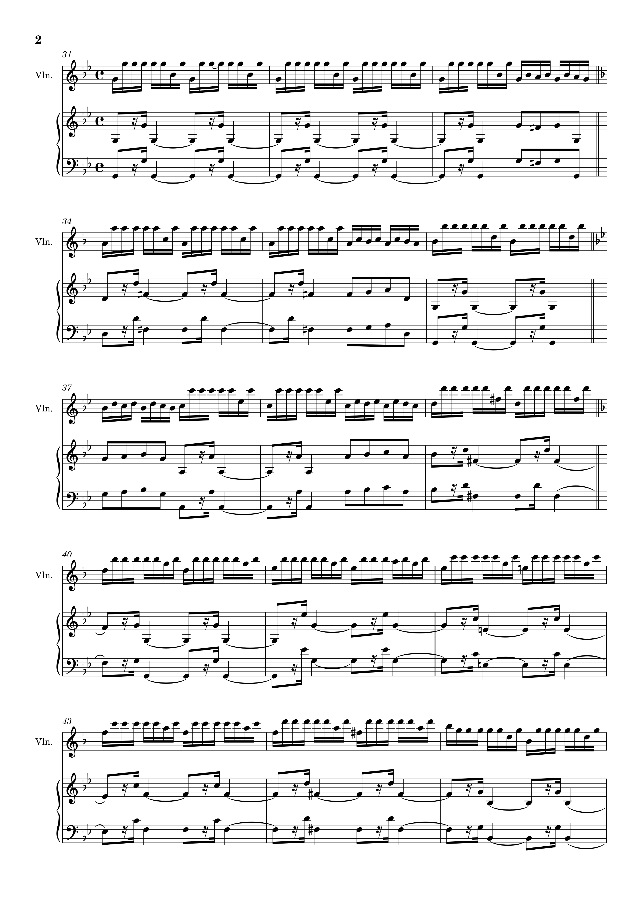
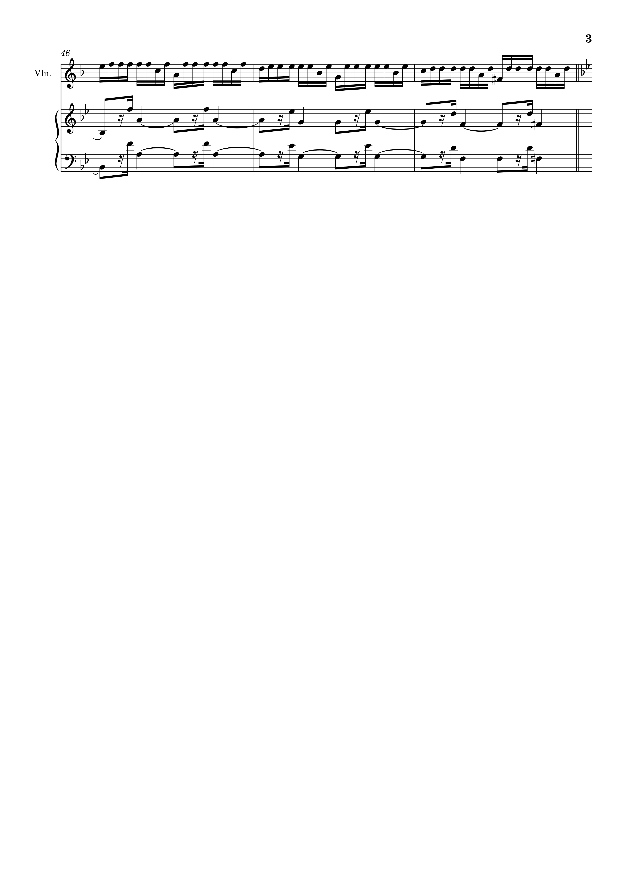
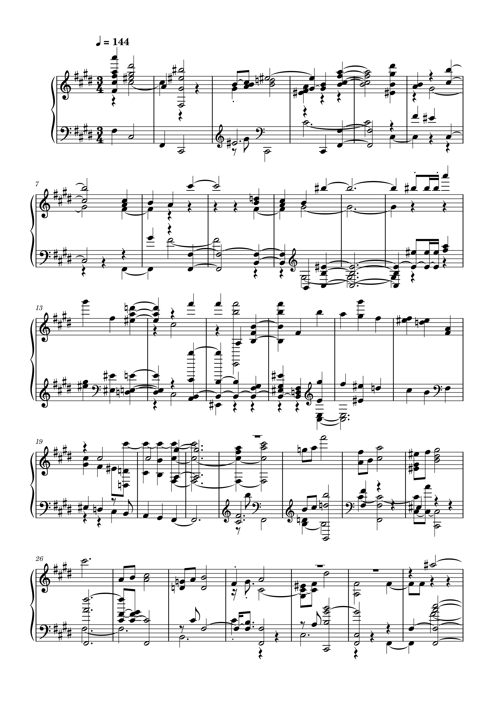
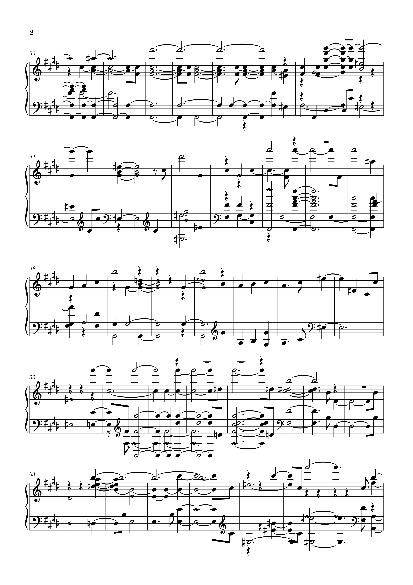
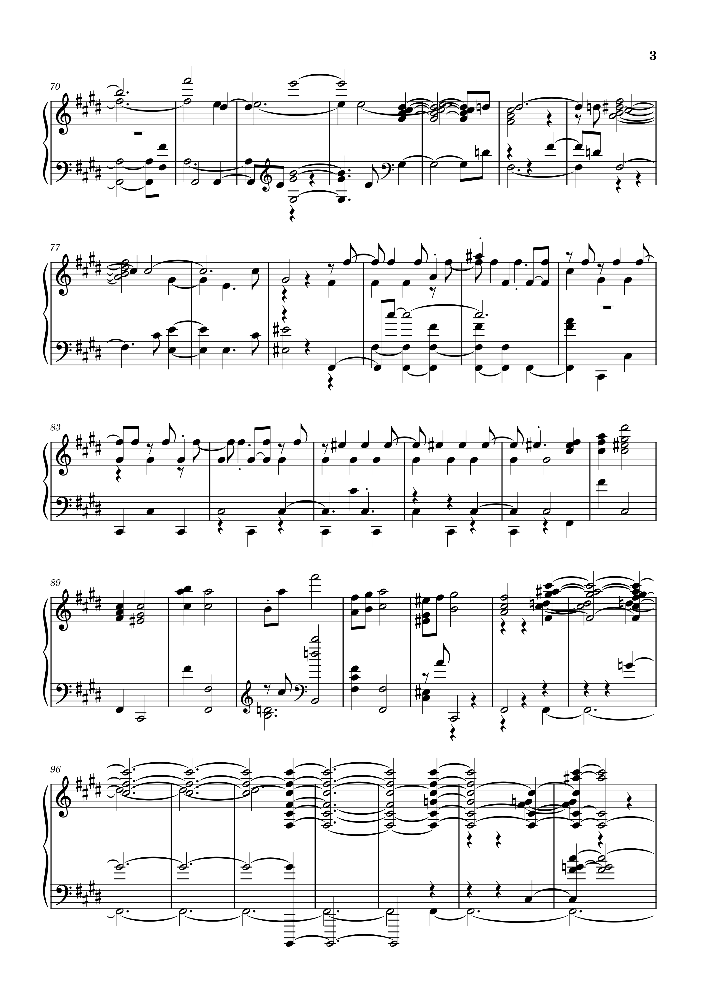

[<kbd>   Home   </kbd>](../README.md) [<kbd>   Week 2   </kbd>](Week2.md) [<kbd>   Week 3   </kbd>](Week3.md) [<kbd>   Week 4   </kbd>](Week4.md) [<kbd>   Week 5   </kbd>](Week5.md) [<kbd>   Week 7   </kbd>](Week7.md) [<kbd>   Week 8   </kbd>](Week8.md) [<kbd>   Week 9   </kbd>](Week9.md) [<kbd>   Week 10   </kbd>](Week10.md) 

# Week 10

## Task 1

In this week's tasks I have used the same three tracks from last week. Looking at the group lab work I can see that it is fairly easy to notice differences in genres, especially in the 2D graph. So I decided to use tracks from the same piece of music as a way to test the limits of the similarity matrix. It will be interesting to see how these present in similarity.

 <table class="content-table">
        <thead>
          <tr>
            <th>Similarity Matrix</th>
            <th>2D Plot</th>
          </tr>
        </thead>
        <tbody>
          <tr>
            <td></td>
            <td></td>
          </tr>
        </tbody>
      </table> 

## Task 2
For this task I have inserted the first three pages of both transcriptions.
### Musescore Transcription

 

### Midi Transcription

  

## Discussion
It can clearly be seen the differences in both transcriptions. After the sonic visualiser transcription, one of the first things I noticed that the violin line has been merged with the piano line, making it harder to read the music. 
Some of the rhythms are incorrect and the way the are written is again harder to read. Some notes are wrong or missing. 
Another problem is that the key of the piece has been transcribed incorrectly. 