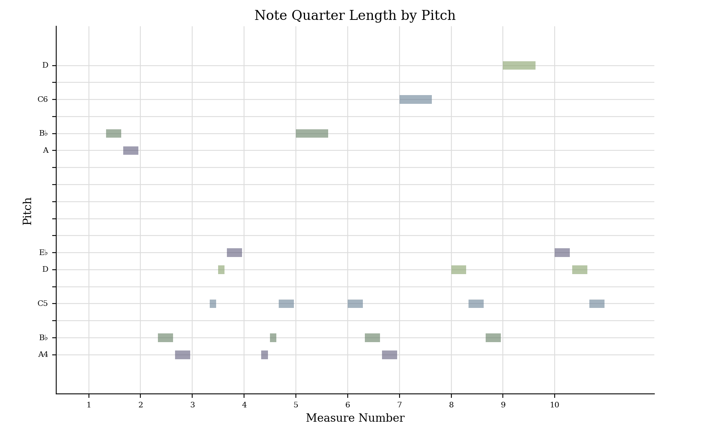
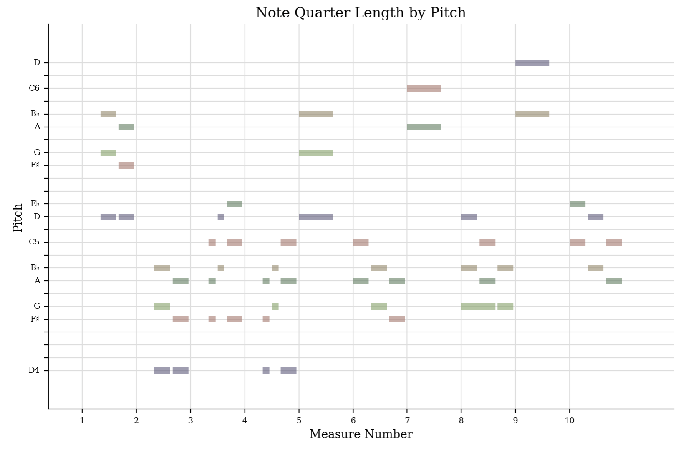
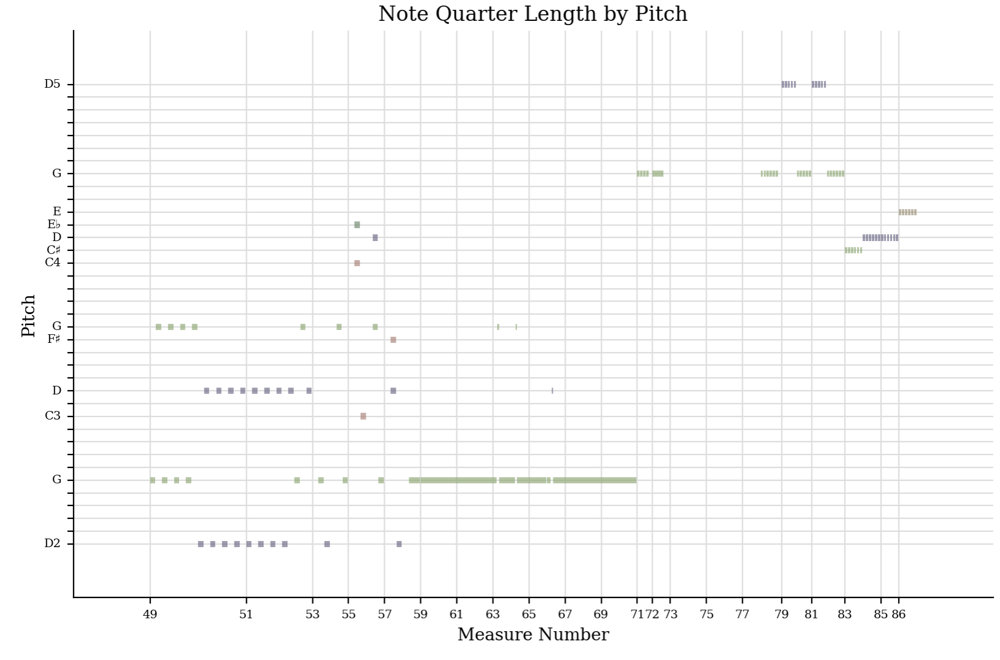

[<kbd>   Home   </kbd>](../README.md) [<kbd>   Week 2   </kbd>](Week2.md) [<kbd>   Week 3   </kbd>](Week3.md) [<kbd>   Week 4   </kbd>](Week4.md)  [<kbd>   Week 5   </kbd>](Week5.md) [<kbd>   Week 7   </kbd>](Week7.md) [<kbd>   Week 8   </kbd>](Week8.md) [<kbd>   Week 9   </kbd>](Week9.md) [<kbd>   Week 10   </kbd>](Week10.md) 

# Week 4
## jSymbolic
Below is a list of some values from my jSymbolic analysis I beleive would be useful.
- Range: 62
- Mean Pitch: 64.78
- Most Commmon Pitch Class: 2 (The key of this piece is D)
- Most Common Rhythmic Value: 0.25 (Sixteeth notes, semiquavers, are the most common)
- Last Pitch: 55
- Pitch Variability: 12.56
- Tempo Variability: 2.97
- Avg. Note Duration: 0.3069 (in seconds)
- Dynamic Range: 43 (loudness = note velocity x (channel volume / 127))

## Music21
**Piano Roll** 
 Below is the violin and treble clef piano parts shown as piano roll for the first 10 measures of my piece. This is interesting to compare as you can see the rhythmic differences and can also identify chords in the piano part. 
 

 **Even more Piano Roll!**
 
  This piano part looks different as it is the bass clef piano part and is also looking at measures 49-86. Here we can see when one movement ends and a new one begins!
    

