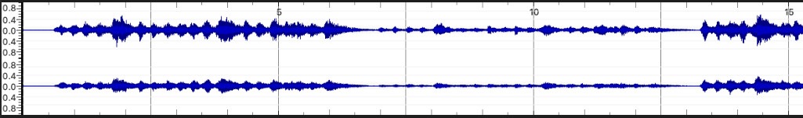
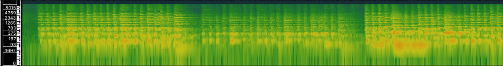
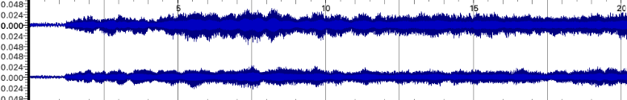
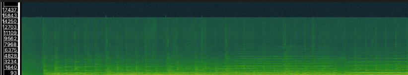
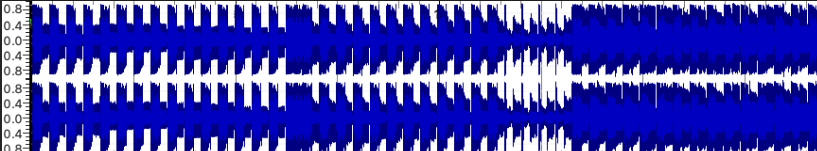
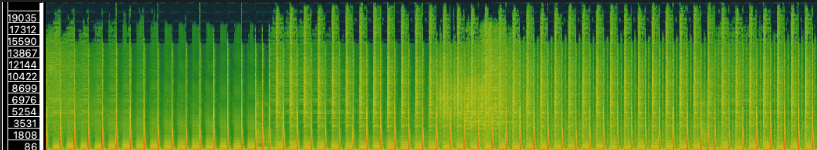

[<kbd>   Home   </kbd>](../README.md) [<kbd>   Week 2   </kbd>](Week2.md) [<kbd>   Week 3   </kbd>](Week3.md) [<kbd>   Week 4   </kbd>](Week4.md) [<kbd>   Week 5   </kbd>](Week5.md) [<kbd>   Week 7   </kbd>](Week7.md) [<kbd>   Week 8   </kbd>](Week8.md) [<kbd>   Week 9   </kbd>](Week9.md) [<kbd>   Week 10   </kbd>](Week10.md) 

# Week 8

## Task 1

| Title  | Artist  | Composer  | Copyright  | Genre  | Source  | File Format  | Number of channels  | Sample rate  | Bits per second  | Duration  |
|---|---|---|---|---|---|---|---|---|---|---|
|Violin Concerto in F major - Allegro| John Harrison (violin), Wichita State University Chamber Players (orchestra), Robert Turizziani (conductor)  | Antonio Vivaldi  | [Creative Commons](https://imslp.org/wiki/IMSLP:Creative_Commons_Attribution-ShareAlike_4.0) | Classical |[imslp.org](https://imslp.org/wiki/Violin_Concerto_in_F_major%2C_RV_293_(Vivaldi%2C_Antonio))   | mp3 | 2 | 48kHz | 171.97 kbit/s  | 05:04 |
|Violin Concerto in F major - Adagio molto| John Harrison (violin), Wichita State University Chamber Players (orchestra), Robert Turizziani (conductor) | Antonio Vivaldi | [Creative Commons](https://imslp.org/wiki/IMSLP:Creative_Commons_Attribution-ShareAlike_4.0) | Classical | [imslp.org](https://imslp.org/wiki/Violin_Concerto_in_F_major%2C_RV_293_(Vivaldi%2C_Antonio))  | mp3 | 2 | 48 kHz | 161.12 kbit/s | 02:33 |
|Winter (The Four Seasons)(Techno Mix)| LANNE & Blaze U, Charles B  | Antonio Vivaldi  | [Creative Commons](https://creativecommons.org/licenses/by-sa/4.0/deed.en) | Techno | [Youtube](https://youtu.be/FgMdQRBcuqo?si=a404b2rEddNTzaq5) / [Hypeddit](https://hypeddit.com/84agl3) | mp3 | 2 | 44.1 kHz | N/A | 02:54 |

## Task 2
Below are small snippets of the full files, click to see the full images!
### Track 1 - Allegro

### Track 2 - Adagio molto

### Track 3 - Winter

## Description

Using time-frequency analysis, like a spectrogram, we can see how different sounds emerge and fade, and we can get a closer look at timbre, tempo, melody, dynamics.

For example, Allegro, which features only stringed instruments, time-frequency analysis shows the sound is less rich and focuses on a specific harmony. In comparison, this rendition of Winter features a variety of instruments and electronic sounds. This shows a much fuller sound and spans across a wider spectrum of frequencies. With this, we know it is possible to catagorise music in some way based on the output of some time-frequncy analyses.

